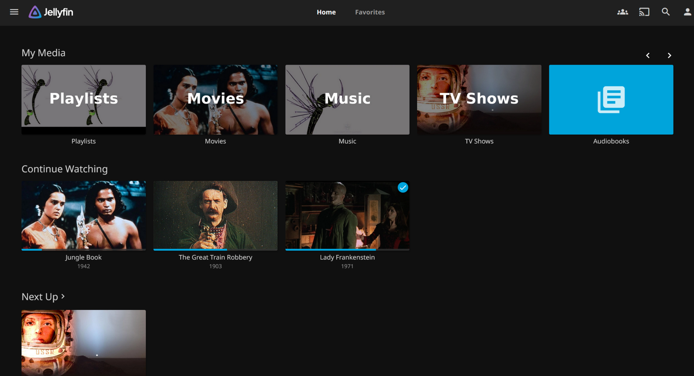
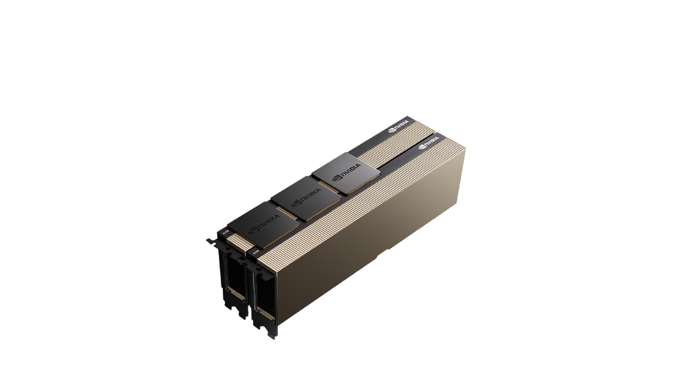
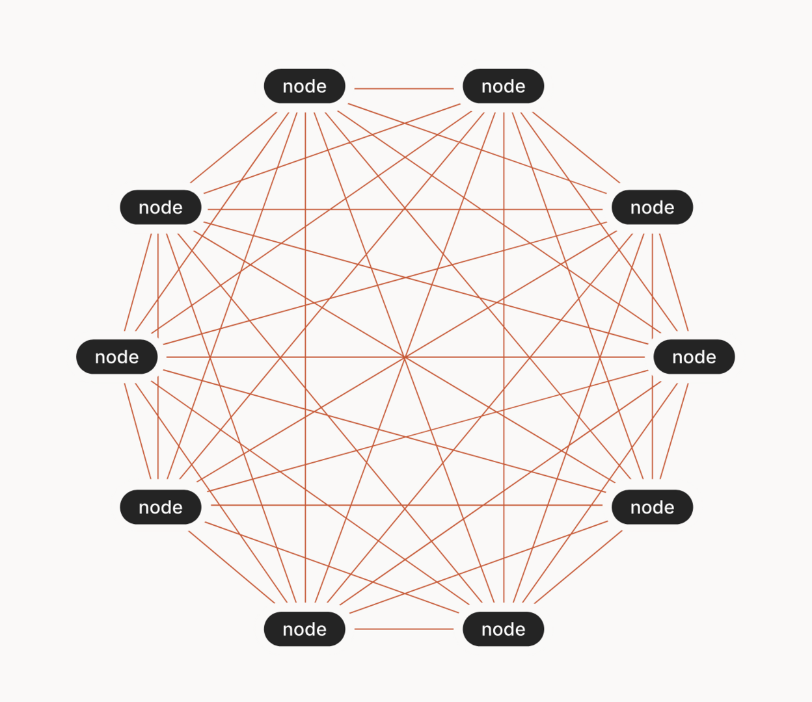
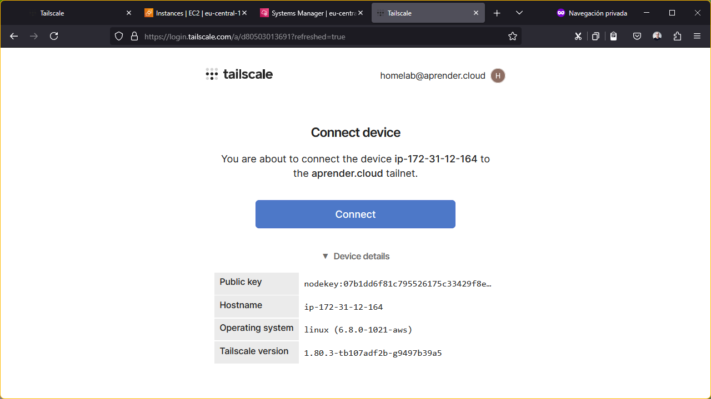
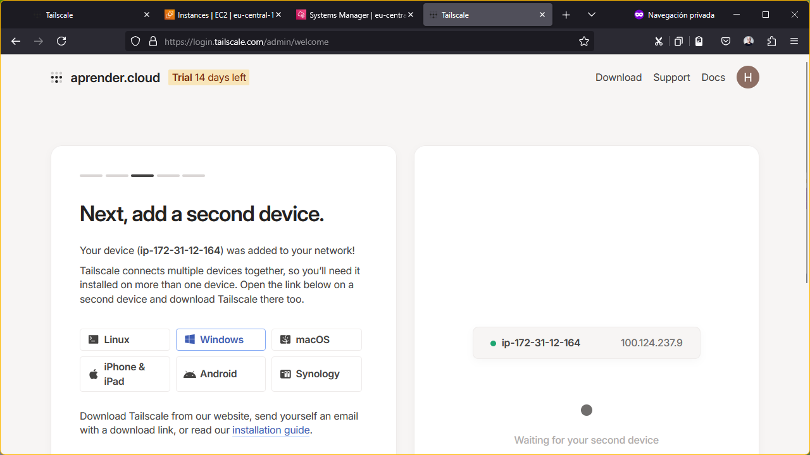
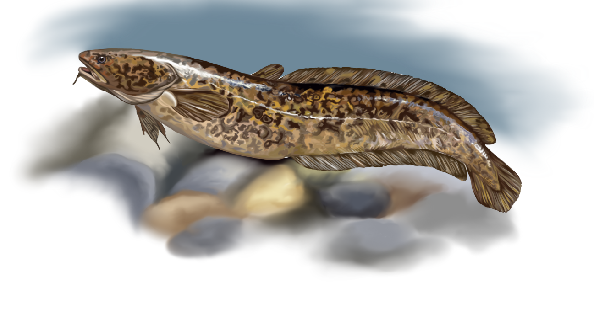

[](#title,.coverbg)

# Build your very own homelab


[](.coverbg.topic)

## Who am I?

[](.coverbg.headrd)

### Javi Moreno


::: Notes

email at javier-moreno dt com

:::

[](.coverbg)

### Postgraduate Course co-Director


::: Notes

You can find more information about the course at its
[web]() or by asking me :)

:::

[](.coverbg)

### Principal Cloud Consultant


[](.coverbg)

### In the cloud from 2012


[](.coverbg)

### 12 years of love


::: Notes

* Explain what the cloud is.
* How incredible has been as way of democratizing technology.
* Technooptimism.
* What services you used: AWS, gmail, twitter
* DID I SAY TWITTER?

:::

[](.coverbg)

### Elon Musk


::: Notes

* Centralized power
* Walled garden
* Prize increasement
* Manipulation
* Massive risk

:::

[](.coverbg)

### The world in 12 years?


::: Notes

* The future is looking more and more like a dystopia.
* High tech, low live.

:::

[](.coverbg)

### Wake up samurai


::: Notes

We are techies. 
We know our staff. 
We want to learn. 
So let's get it back.

:::

[](.coverbg.topic)

## HomeLab

[](.coverbg)

### What?


::: Notes

It is the opposite to a professional infrastructure.
A HomeLab is a set of compute resources that you can **break** unexpectedly,
but that works most of the time.

:::

[](.coverbg)

### Why?


::: Notes

Fun. Learn. Comfort. Profit?


:::

[](.coverbg)

### How?


::: Notes

Meet Tequila, a MSI gt72 Dominator Pro
with a GTX 1060 with 3GB VRAM and 16GB RAM.
3.8Kg of mobile (more or less) computer.

:::

[](.coverbg)

### Where


[](.coverbg.topic)

## The basic stack

[](.coverbg)

### Windows 10


[](.coverbg)

### Docker


::: Notes

* Explain the problems of sharing an OS
* Present docker as a solution.

:::

[](.coverbg)

### WSL


::: Notes

* WSL allows native Linux containers under windows.
* Windows is blue, WSL is yellow.
* Ok, a bit cripy maybe.

:::

### Automatic start


```bash

// Just pres `Win+R`, type `shell:startup`, 
// and drop it there with the name `wsl-init.vbe`.

Set ws = CreateObject("Wscript.Shell")
ws.run "wsl -d Ubuntu", vbhide
```

::: Notes

Tequila doubles as the family console, mostly for playing
[Vampire Surivors](https://store.steampowered.com/app/1794680/Vampire_Survivors/).
I'm way too old for investing time in hardware configuration,
so the machine is running Windows. That makes 
[WSL](https://learn.microsoft.com/en-us/windows/wsl/install)
the most natural way of starting containers. To make things
smoother, I've added a simple script for starting it every
time the computer is bootstrapped.

Just pres `Win+R`, type `shell:startup`, and drop it there
with the name `wsl-init.vbe`.

```vbe
Set ws = CreateObject("Wscript.Shell")
ws.run "wsl -d Ubuntu", vbhide
```

:::

[](.coverbg)

### Docker under WSL under Windows


::: Notes

* This is a references of a film from the 60's.
* Is this ideal? No. BUT...

:::

[](.coverbg)


::: Notes

* I can play.

:::

## Regular services

[](.coverbg.screenshot)

### Photos with [Immich](https://immich.app/)


[](.coverbg.screenshot)

### IoT with [Home Assistant](https://www.home-assistant.io/)


[](.coverbg)

### Minecraft server


[](.coverbg.screenshot.dark)

### Media management with [Jellyfin](https://jellyfin.org/)



[](.coverbg)

### Demo!


::: Notes

```
cd jedai
cd jelly

  # Explain what a registry is
docker search jellyfin

  # Explain what an image is
docker pull jellyfin/jellyfin

docker run \
  --name jellyfin \
  -p 8096:8096 \
  --volume $(pwd)/config:/config \
  --volume $(pwd)/cache:/cache \
  --mount type=bind,source=$(pwd)/media,target=/media \
  jellyfin/jellyfin
```

:::


[](.coverbg.topic)

## Advanced services

[](.coverbg)

### Image generation with [Fooocus](https://github.com/lllyasviel/Fooocus)


[](.coverbg)

### LLM with [Ollama](https://ollama.com)


::: Notes

g5.12xlarge (96GB VRAM) with Llama 2 90B generates 2 tokens/s with a input context of 2500 tokens, as
explained in [Benchmarking Llama 2 70B inference on AWS’s g5.12xlarge vs an A100](https://medium.com/@krohling/benchmarking-llama-2-70b-inference-on-awss-g5-12xlarge-vs-an-a100-9d387d969177), at $2 per hour.

g4dn.xlarge (16GB VRAM) at spot costs $0.16 per hour, being able to fluently run smaller models, Whisper large, etc.

:::

[](.coverbg.topic)

## Challenges

[](.coverbg)

### Remote access


::: Notes

From my parent's house, from our phones.

:::

[](.coverbg)

### Resources



::: Notes

I think VRAM is the biggest limitation in a home scenario.
This NVidia A100 with 80GB costs around $10K. WTF.

:::

[](.coverbg.topic)

### Connectivity complexity


::: Notes

I mean, why was I doing this? This is a HomeLab, not an Enterprise 
Architecture. It was supposed to be fun! **I already have a job**.

:::

[](.coverbg.topic)

## Introducing Tailscale

[](.coverbg.screenshot)

### Company history


::: Notes

* Founded in 2019 in Ontario by ex-googlers Avery Pennarun, David Carney and Brad Fitzpatrick 
* Small and medium sized enterprise (around 80 employees)
* Focused in one product

::: Notes


[](#mesh,.illustration.partial)

### Product technology



* Overlay network (tailnet)
* UDP peer-to-peer VPN
* Wireguard-based 
* Open source client
* Free for 3 users / 100 devices
* [Alternative](https://headscale.net/) control plane available

::: Notes

* Overlay approach is portable.
* Peer means efficient.
* Wireguard is open source and battle tested.

:::

[](.coverbg.screenshot)

### [Account creation](https://tailscale.com/)

TODO

::: Notes

Use your preferred IdP.

:::

[](.coverbg)


[](.coverbg)


[](.coverbg)


[](.coverbg)


[](.coverbg)


[](.coverbg)


[](.coverbg.screenshot)

### Client install


::: Notes

Next, next, next finish.

Windows, Linux, MacOS, Android, Chromebooks, Google TV, iOS, Apple TV.

:::

[](.coverbg)

### Demo!


::: Notes

* On Android or Windows it is straightforward
* Demo on Linux
* Show the admin panel on the machine tab once it's done
* Ping from android

```bash
sudo su ubuntu
cd 
curl -fsSL https://tailscale.com/install.sh | sh
sudo tailscale up --hostname=demoserver
```

:::

[](.coverbg)


::: Notes

Many times, there is no node configuration, apart from providing authorization.

:::


[](.coverbg)


[](.coverbg)


[](.coverbg)



[](.coverbg)



[](.coverbg)


[](.coverbg)

### [Tailnet configuration](https://login.tailscale.com/admin/dns)


::: Notes

One user will be associated to one tailnet, but devices can be shared between tailnets.

:::

[](.coverbg)


[](.coverbg)


[](.coverbg)


[](.coverbg)


[](.coverbg)




[](.coverbg)


[](.coverbg)


[](.coverbg)


[](.coverbg)

### Demo!


::: Notes

Jump into an EC2 instance and install Tailscale:

```bash
curl -fsSL https://pkgs.tailscale.com/stable/ubuntu/noble.noarmor.gpg | sudo tee /usr/share/keyrings/tailscale-archive-keyring.gpg >/dev/null
curl -fsSL https://pkgs.tailscale.com/stable/ubuntu/noble.tailscale-keyring.list | sudo tee /etc/apt/sources.list.d/tailscale.list

sudo apt-get update
sudo apt-get install tailscale -y

sudo tailscale up --hostname=fooocus
```
:::

[](.coverbg.topic)


## Features

[](.coverbg.screenshot.dark)

### Mobile access


::: Notes

Immich has a mobile App that can be used from a smartphone connected to the
tailnet.

:::

[](#quiz,.illustration)

### Public devices

[https://quiz.snow-burbot.ts.net](https://quiz.snow-burbot.ts.net)


::: Notes


It is possible to use `tailnetd` as an HTTPs proxy, both internally and publicly.
That feature can be activate with the `serve` and `funnel` commands, or configured
using a `json` file like in the Quizz container device.
:::

[](.coverbg.screenshot.dark)

### Exit node


::: Notes

Sets the gateway of one device to any other device configured to
work as *exit node*. It is also possible to integrate it with
[Mullvad VPN](https://mullvad.net).

This allows devices on other apartments to use your home IP,
fore example.

:::

[](.coverbg)

### Audited ssh


::: Notes

Once a device is configured for 
[accepting ssh connections](https://tailscale.com/kb/1193/tailscale-ssh)
through Tailscale, the authorized users will be able to
jump to that node using their Tailscale authentication,
and all the commands will be recorded for audit.

:::

[](.coverbg)

### Subnet propagation


::: Notes

One node in the VPC with access to the internet can act as a subnet router, by
adding the `--advertise-routes` flag to the daemon configuration. The next step
consists in adding the [VPC DNS server to the tailnet](https://tailscale.com/kb/1141/aws-rds),
and that's all.

:::

[](.topic)

## Gotchas

[](.coverbg)

### Windows & WSL


::: Notes

You can run the Tailscale daemon in WSL and in containers at the same time.
But you can't run it on Windows and WSL: the responses don't reach the WSL daemon.

:::

[](.coverbg.screenshot.dark)

### WSL network propagation


::: Notes

A Mosquitto MQTT node resides in Tequila, but Tailscale 
on WSL seems to miss local network advertisement so the 
IoT devices in my home network are not able to access it. Running
Tailscale on them is out of question, so  to solve it I've set 
a bridge between the Windows host and te WSL port with

:::


[](#closing,.illustration)

### Closing words


[tinyurl.com/tlscl](https://tinyurl.com/tlscl)

Perhaps it would be nice to evolve towards a world 
where we citizens also owned part of **our infrastructure**.