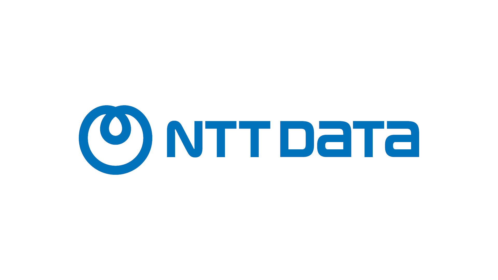
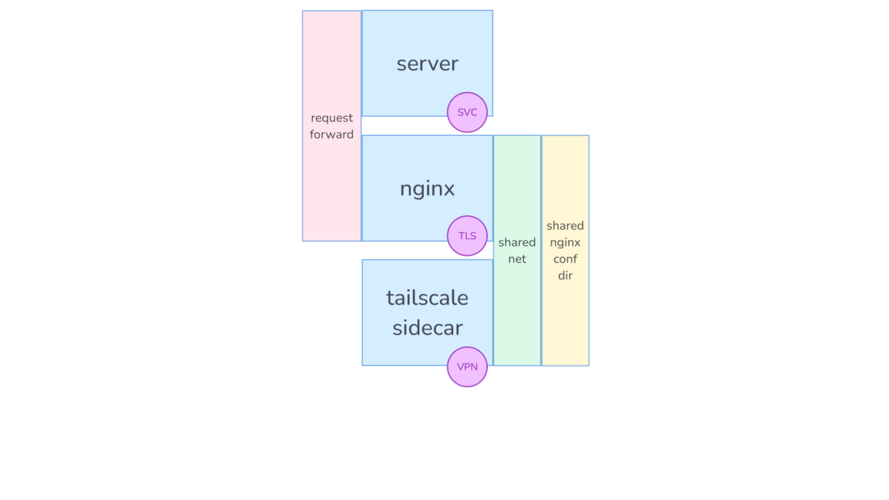

# HomeLab with Tailscale, Docker and AWS


## Who am I?

### Javi Moreno


::: Notes

email at javier-moreno dt com

:::

### Capside Cloud Evangelist


### Principal Cloud Consultant at NTT Data



### UPCSchool Cloud Computing Architecture Postgraduate Course co-Director


## HomeLab

### What?


::: Notes

It is the opposite to a professional infrastructure.
A HomeLab is a set of compute resources that you can **break** unexpectedly,
but that works most of the time.

:::

### Why?


::: Notes

Fun. Learn. Comfort. Profit?


:::

### How?


::: Notes

Meet Tequila, a MSI gt72 Dominator Pro
with a GTX 1060 with 3GB VRAM and 16GB RAM.
3.8Kg of mobile (more or less) computer.

:::

### Where


## Home services

### Photos with [Immich](https://immich.app/)


### IoT with [Home Assistant](https://www.home-assistant.io/)


### Media management with [Jellyfin](https://jellyfin.org/)


### Quizzes with [Quizi](https://github.com/cosmoart/quiz-game)


::: Notes

We use quizzes a lot in the postgraduate course, as it is the
most effective way of fixing concepts in long-term memory by
practicing [spaced repetition](https://www.amazon.es/Make-Stick-Science-Successful-Learning/dp/0674729013).

Unfortunately, the tool we used for it has changed its
terms and conditions, so I'm looking for a replacement.
During the following months, I plan to adapt 
[my fork](https://github.com/ciberado/quiz-game)
of the original Quizi to fill this role.
:::

## Experimentation services

### Image generation with [Fooocus](https://github.com/lllyasviel/Fooocus)


### LLM with [https://ollama.com]


::: Notes

g5.12xlarge (96GB VRAM) with Llama 2 90B generates 2 tokens/s with a input context of 2500 tokens, as
explained in [Benchmarking Llama 2 70B inference on AWS’s g5.12xlarge vs an A100](https://medium.com/@krohling/benchmarking-llama-2-70b-inference-on-awss-g5-12xlarge-vs-an-a100-9d387d969177), at $2 per hour.

g4dn.xlarge (16GB VRAM) at spot costs $0.16 per hour, being able to fluently run smaller models, Whisper large, etc.

:::

## Challenges

### Remote access


::: Notes

From my parent's house, from our phones.

:::

### Resources


::: Notes

I think VRAM is the biggest limitation in a home scenario.
This NVidia A100 with 80GB costs around $10K. WTF.

:::

### Solution: extend it to AWS

### Challenge: connectivity price


::: Notes

Public endpoints require multiple subnets, NATgw, public IPs, ALB... 
and we haven't even talked about the EC2 instances. It all adds up.
AWS's first source of income are NATgw, probably.

:::

### Challenge: connectivity complexity


::: Notes

I mean, why was I doing this? This is a HomeLab, not an Enterprise 
Architecture. It was supposed to be fun! **I already have a job**.

:::

## Introducing Tailscale

### Company history


::: Notes

* Founded in 2019 in Ontario by ex-googlers Avery Pennarun, David Carney and Brad Fitzpatrick 
* Small and medium sized enterprise (around 80 employees)
* Focused in one product

::: Notes


### Product technology


* Overlay network (tailnet)
* UDP peer-to-peer VPN
* Wireguard-based 
* Open source client
* Free for 3 users / 100 devices

::: Notes

* Overlay approach is portable.
* Peer means efficient.
* Wireguard is open source and battle tested.

:::

### [Account creation](https://tailscale.com/)


::: Notes

Use your preferred IdP.

:::

### [Tailnet configuration](https://login.tailscale.com/admin/dns)


* Rename the tailnet.
* Activate MagicDNS.
* Activate automatic HTTPs certificates.

::: Notes

One user will be associated to one tailnet, but devices can be shared between tailnets.

:::

### Client install


::: Notes

Next, next, next finish.

Windows, Linux, MacOS, Android, Chromebooks, Google TV, iOS, Apple TV.

:::

### Node configuration


::: Notes

Many times, there is no node configuration, apart from providing authorization.

:::

### Demo!


::: Notes

Jump into an EC2 instance and install Tailscale:

```bash
curl -fsSL https://pkgs.tailscale.com/stable/ubuntu/noble.noarmor.gpg | sudo tee /usr/share/keyrings/tailscale-archive-keyring.gpg >/dev/null
curl -fsSL https://pkgs.tailscale.com/stable/ubuntu/noble.tailscale-keyring.list | sudo tee /etc/apt/sources.list.d/tailscale.list

sudo apt-get update
sudo apt-get install tailscale -y

sudo tailscale up --hostname=fooocus
```
:::

## Shared environment

### Docker under WSL


::: Notes

Tequila doubles as the family console, mostly for playing
[Vampire Surivors](https://store.steampowered.com/app/1794680/Vampire_Survivors/).
I'm way too old for investing time in hardware configuration,
so the machine is running Windows. That makes 
[WSL](https://learn.microsoft.com/en-us/windows/wsl/install)
the most natural way of starting containers. To make things
smoother, I've added a simple script for starting it every
time the computer is bootstrapped.

Just pres `Win+R`, type `shell:startup`, and drop it there
with the name `wsl-init.vbe`.

```vbe
Set ws = CreateObject("Wscript.Shell")
ws.run "wsl -d Ubuntu", vbhide
```

:::

### Docker compose approach



::: Notes

The `nginx` container (that will provide the service name) just forwards
the TLS traffic to the actual server.

The tailscale container provides the network and the `tailscale` command.
It shares a volume with the `nginx` container, so it is possible to use
`tailscale cert` for automatically provision the https cert.

```yaml
services:
  - xxx-server    # The service image
  - ts-xxx        # The tailscale software
  - xxx           # A nginx proxy
```

:::

### Mobile access


::: Notes

Immich has a mobile App that can be used from a smartphone connected to the
tailnet.

:::

### WSL network bridging


::: Notes

A Mosquitto MQTT node resides in Tequila, but Tailscale 
on WSL seems to miss local network advertisement so the 
IoT devices in my home network are not able to access it. Running
Tailscale on them is out of question, so  to solve it I've set 
a bridge between the Windows host and te WSL port with

:::

### Public devices


::: Notes

https://quiz.snow-burbot.ts.net


It is possible to use `tailnetd` as an HTTPs proxy, both internally and publicly.
That feature can be activate with the `serve` and `funnel` commands, or configured
using a `json` file like in the Quizz container device.
:::

### Exit node


::: Notes

Sets the gateway of one device to any other device configured to
work as *exit node*. It is also possible to integrate it with
[Mullvad VPN](https://mullvad.net).

:::

### Audited ssh


::: Notes

Once a device is configured for 
[accepting ssh connections](https://tailscale.com/kb/1193/tailscale-ssh)
through Tailscale, the authorized users will be able to
jump to that node using their Tailscale authentication,
and all the commands will be recorded for audit.

:::

### Subnet propagation


::: Notes

One node in the VPC with access to the internet can act as a subnet router, by
adding the `--advertise-routes` flag to the daemon configuration. The next step
consists in adding the [VPC DNS server to the tailnet](https://tailscale.com/kb/1141/aws-rds),
and that's all.

:::

### Closing words


